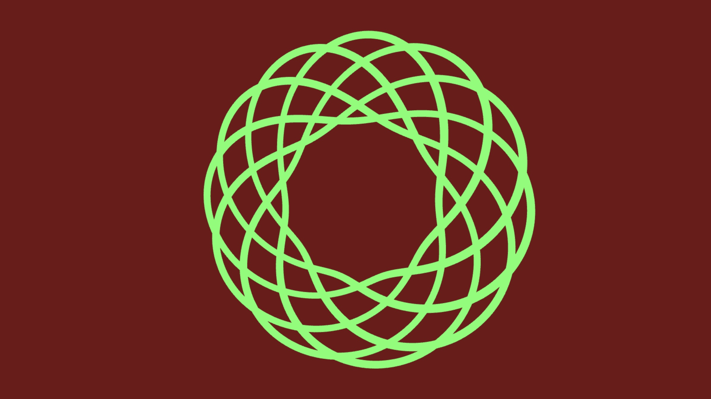

# Torus Knots

This repository contains a collection of P5 sketches that render torus knots.  From [Wolfram MathWorld](https://mathworld.wolfram.com/TorusKnot.html):

"A (p,q)-torus knot is obtained by looping a string through the hole of a torus p times with q revolutions before joining its ends."

Daniel Shiffman renders a complex 3D knot in his [3D knot coding challenge](https://thecodingtrain.com/challenges/https://thecodingtrain.com/challenges/87-3d-knots).

I have used Daniel's code, but I have substituted the following equations to calculate the cartesian coordinates. Equations from Lee Stemkoski at [Parameterized Knots](https://home.adelphi.edu/~stemkoski/knotgallery/). 

`let phi = p * beta;
 let theta = q * beta;
 x = r * cos(theta) * (sc + cos(phi));
    y = r * sin(theta) * (sc + cos(phi));
    z = r * sin(phi);
`

(8,9) torus knot 

[P5 sketch](https://editor.p5js.org/kfahn/sketches/gKqXNfljn)
[Code](https://github.com/kfahn22/torus_knots/tree/main/torusKnot)

I have also rendered the torus knot with a shader in P5.js. The Art of Code's YouTube tutorial [Torus Knots explained!](https://www.youtube.com/watch?v=2dzJZx0yngg) was very helpful in explaining how to render a torus knot in shadertoy, which I ported to P5.js.

<iframe src="https://editor.p5js.org/kfahn/full/gKqXNfljn"></iframe>

[Code]()