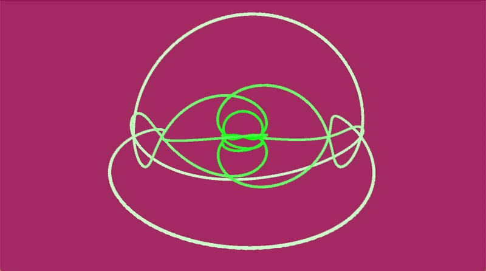

# 3D Knots

This repository contains a collection of P5 sketches that render torus knots, which you can think of as a string wrapped around a donut.  More formally:

>A (p,q)-torus knot is obtained by looping a string through the hole of a torus p times with q revolutions before joining its ends. [Wolfram MathWorld](https://mathworld.wolfram.com/TorusKnot.html)

My journey with rendering knots started with Daniel Shiffman's [3D knot coding challenge](https://thecodingtrain.com/challenges/https://thecodingtrain.com/challenges/87-3d-knots).  He renders a knot using the following code, incrementing beta each time through the draw loop.

`let r = 100 * (0.8 + 1.2 * sin(6.0 * beta));`
`let theta = 2 * beta;`  
`let phi = 0.6 * PI * sin(12 * beta);`  
`let x = r * cos(phi) * cos(theta);`    
`let y = r * cos(phi) * sin(theta);`  
`let z = r * sin(phi);`

I have used Daniel's code, but I have replaced the code to calculate the cartesian coordinates. Equations from Lee Stemkoski at [Parameterized Knots](https://home.adelphi.edu/~stemkoski/knotgallery/). 

`let phi = p * beta;`  
`let theta = q * beta;`  
`x = r * cos(theta) * (sc + cos(phi));`  
`y = r * sin(theta) * (sc + cos(phi));`  
`z = r * sin(phi);`

(8,9) torus knot 

- [Animated torus knot](https://editor.p5js.org/kfahn/sketches/gKqXNfljn)  
- [Code](https://github.com/kfahn22/torus_knots/tree/main/torusKnot)

## 2D Mathematical Rose

If `z = -sin(phi)` is used instead of `z = r * sin(phi);`, you get a 2D curve.  With c
= 0, you get a mathematical rose. 

`let r = 70 * (c + cos(k * a));`  
`let x = r * cos(a);`  
`let y = r * sin(a);`  

- [Polar Donut](https://editor.p5js.org/kfahn/sketches/ycprY17Yf)
- [Mathematical Rose Coding Challenge](https://thecodingtrain.com/challenges/55-mathematical-rose-patterns)

## Torus Knots Rendered with a shader

I have also rendered the torus knot with a shader in P5.js. The Art of Code's YouTube tutorial [Torus Knots explained!](https://www.youtube.com/watch?v=2dzJZx0yngg) was very helpful in explaining how to render a torus knot in shadertoy, which I ported to P5.js.  I have three different versions, which are sequentially loaded.

Solomon's Seal / Cinquefoil torus knot (5,2)

(3,1) torus knot

(7,2) torus knot

[Code](https://github.com/kfahn22/torus_knots/tree/main/torus_knot)